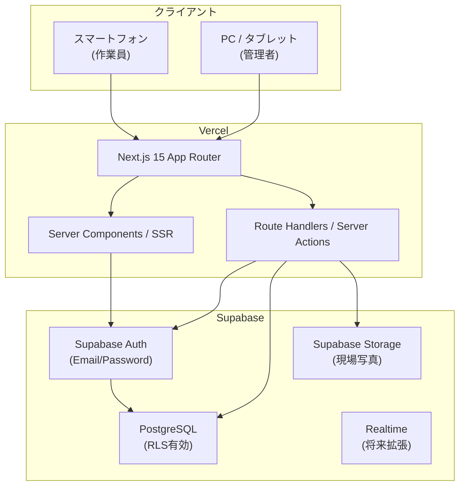
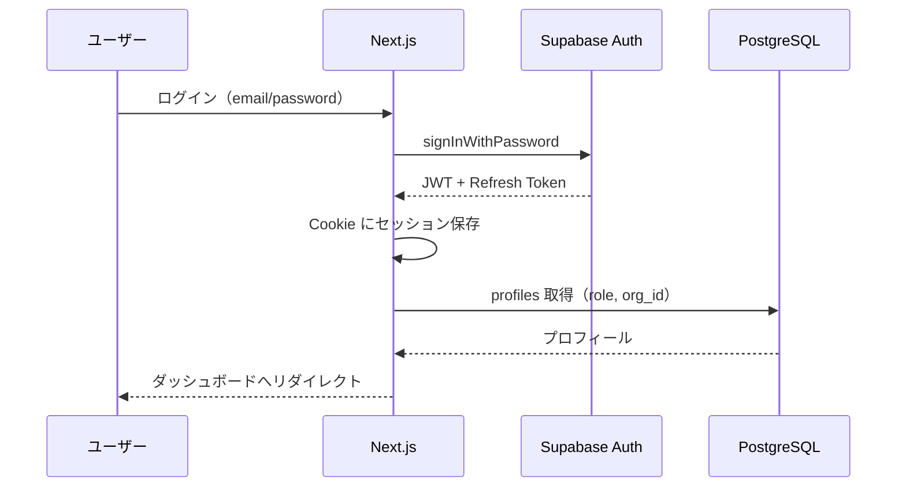
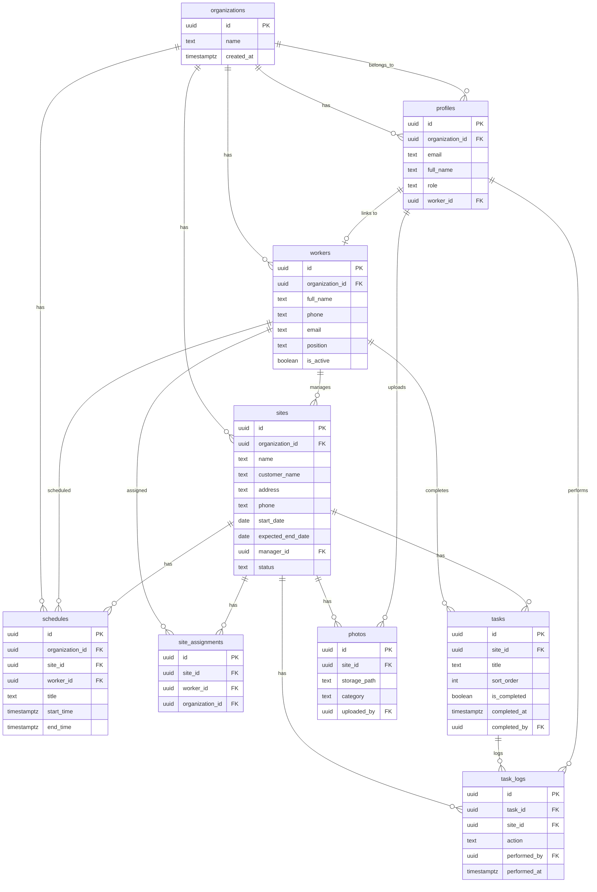

# Stark Works — システム設計書

建設業・設備業・水道業向け現場進捗管理システム

---

## 1. システム全体アーキテクチャ

### 1.1 概要

Stark Works は、Next.js 15（App Router）をフロントエンド兼 BFF 層として、Supabase をバックエンド（認証・DB・Storage）として利用するマルチテナント SaaS です。各工事会社（テナント）が独立したデータ空間を持ち、管理者と作業員の2ロールで運用します。

### 1.2 アーキテクチャ図



### 1.3 レイヤー構成

| レイヤー | 技術 | 責務 |
|---------|------|------|
| プレゼンテーション | React 19 + shadcn/ui + TailwindCSS | 60代向け大きなUI、スマホファースト |
| アプリケーション | Next.js Server Actions / Route Handlers | ビジネスロジック、バリデーション |
| 認証 | Supabase Auth + Middleware | セッション管理、ルート保護 |
| データ | Supabase PostgreSQL + RLS | テナント分離、ロールベースアクセス |
| ファイル | Supabase Storage | 現場写真（着工前/作業中/完了後） |
| デプロイ | Vercel | CI/CD、Edge Middleware |

### 1.4 マルチテナント戦略

- **テナント単位**: `organizations` テーブル（工事会社）
- **ユーザー**: `profiles` が `organization_id` に紐づく
- **データ分離**: 全テーブルに `organization_id` を持たせ、RLS で強制
- **ロール**: `admin`（全権限）/ `worker`（担当現場のみ）

### 1.5 認証フロー



### 1.6 セキュリティ方針

- Row Level Security（RLS）を全テーブルで有効化
- Storage バケットも RLS ポリシーで組織単位に制限
- Server Actions では Zod による入力バリデーション
- 作業員は `site_assignments` 経由で担当現場のみアクセス可能

---

## 2. フォルダ構成

```
stark-works/
├── app/
│   ├── (auth)/
│   │   ├── login/
│   │   │   └── page.tsx
│   │   ├── reset-password/
│   │   │   └── page.tsx
│   │   └── layout.tsx
│   ├── (dashboard)/
│   │   ├── dashboard/
│   │   │   └── page.tsx
│   │   ├── sites/
│   │   │   ├── page.tsx              # 現場一覧
│   │   │   ├── new/
│   │   │   │   └── page.tsx
│   │   │   └── [id]/
│   │   │       ├── page.tsx          # 現場詳細
│   │   │       └── edit/
│   │   │           └── page.tsx
│   │   ├── workers/
│   │   │   ├── page.tsx
│   │   │   ├── new/
│   │   │   │   └── page.tsx
│   │   │   └── [id]/
│   │   │       └── edit/
│   │   │           └── page.tsx
│   │   ├── schedule/
│   │   │   └── page.tsx
│   │   └── layout.tsx                # サイドバー + ヘッダー
│   ├── api/
│   │   └── auth/
│   │       └── callback/
│   │           └── route.ts
│   ├── layout.tsx
│   ├── page.tsx                      # ルート → リダイレクト
│   └── globals.css
├── components/
│   ├── ui/                           # shadcn/ui
│   ├── layout/
│   │   ├── app-sidebar.tsx
│   │   ├── app-header.tsx
│   │   └── mobile-nav.tsx
│   ├── dashboard/
│   │   ├── stat-card.tsx
│   │   └── dashboard-stats.tsx
│   ├── sites/
│   │   ├── site-card.tsx
│   │   ├── site-form.tsx
│   │   ├── site-list.tsx
│   │   ├── progress-bar.tsx
│   │   ├── task-checklist.tsx
│   │   └── photo-gallery.tsx
│   ├── workers/
│   │   ├── worker-form.tsx
│   │   └── worker-list.tsx
│   ├── schedule/
│   │   ├── calendar-view.tsx
│   │   ├── schedule-event.tsx
│   │   └── schedule-form.tsx
│   └── shared/
│       ├── page-header.tsx
│       ├── empty-state.tsx
│       ├── loading-spinner.tsx
│       └── confirm-dialog.tsx
├── lib/
│   ├── supabase/
│   │   ├── client.ts                 # ブラウザ用
│   │   ├── server.ts                 # Server Component用
│   │   └── middleware.ts
│   ├── actions/
│   │   ├── auth.ts
│   │   ├── sites.ts
│   │   ├── tasks.ts
│   │   ├── workers.ts
│   │   ├── schedules.ts
│   │   └── photos.ts
│   ├── validations/
│   │   ├── site.ts
│   │   ├── worker.ts
│   │   ├── task.ts
│   │   └── schedule.ts
│   ├── utils/
│   │   ├── cn.ts
│   │   ├── date.ts
│   │   └── progress.ts
│   └── types/
│       └── database.ts               # Supabase 型定義
├── hooks/
│   ├── use-user.ts
│   └── use-media-query.ts
├── middleware.ts
├── supabase/
│   ├── migrations/
│   │   └── 001_initial_schema.sql
│   └── seed.sql
├── public/
├── docs/
│   └── DESIGN.md
├── .env.local.example
├── next.config.ts
├── tailwind.config.ts
├── components.json
├── package.json
└── tsconfig.json
```

---

## 3. DB設計

### 3.1 テーブル一覧

#### organizations（テナント / 工事会社）

| カラム | 型 | 説明 |
|--------|-----|------|
| id | uuid PK | |
| name | text NOT NULL | 会社名 |
| created_at | timestamptz | |

#### profiles（ユーザープロフィール）

| カラム | 型 | 説明 |
|--------|-----|------|
| id | uuid PK | auth.users.id と同一 |
| organization_id | uuid FK | 所属組織 |
| email | text | |
| full_name | text | 表示名 |
| role | text | `admin` / `worker` |
| worker_id | uuid FK nullable | 作業員レコードへのリンク |
| created_at | timestamptz | |

#### workers（作業員マスタ）

| カラム | 型 | 説明 |
|--------|-----|------|
| id | uuid PK | |
| organization_id | uuid FK | |
| full_name | text NOT NULL | 氏名 |
| phone | text | 電話番号 |
| email | text | メール |
| position | text | 役職 |
| is_active | boolean DEFAULT true | |
| created_at | timestamptz | |
| updated_at | timestamptz | |

#### sites（現場）

| カラム | 型 | 説明 |
|--------|-----|------|
| id | uuid PK | |
| organization_id | uuid FK | |
| name | text NOT NULL | 現場名 |
| customer_name | text | 顧客名 |
| address | text | 住所 |
| phone | text | 電話番号 |
| start_date | date | 工事開始日 |
| expected_end_date | date | 完了予定日 |
| manager_id | uuid FK | 担当責任者（workers） |
| status | text | `not_started` / `in_progress` / `on_hold` / `completed` |
| created_at | timestamptz | |
| updated_at | timestamptz | |

#### site_assignments（現場担当割当）

| カラム | 型 | 説明 |
|--------|-----|------|
| id | uuid PK | |
| site_id | uuid FK | |
| worker_id | uuid FK | |
| organization_id | uuid FK | |
| created_at | timestamptz | |

> 作業員ロールの閲覧範囲制御に使用

#### tasks（作業チェックリスト項目）

| カラム | 型 | 説明 |
|--------|-----|------|
| id | uuid PK | |
| site_id | uuid FK | |
| organization_id | uuid FK | |
| title | text NOT NULL | 作業名 |
| sort_order | int DEFAULT 0 | 表示順 |
| is_completed | boolean DEFAULT false | |
| completed_at | timestamptz | 完了日時 |
| completed_by | uuid FK nullable | 完了作業者（workers） |
| created_at | timestamptz | |

#### task_logs（作業完了ログ — 監査用）

| カラム | 型 | 説明 |
|--------|-----|------|
| id | uuid PK | |
| task_id | uuid FK | |
| site_id | uuid FK | |
| organization_id | uuid FK | |
| action | text | `completed` / `reopened` |
| performed_by | uuid FK | profiles.id |
| performed_at | timestamptz | |
| note | text | 備考 |

#### schedules（スケジュール）

| カラム | 型 | 説明 |
|--------|-----|------|
| id | uuid PK | |
| organization_id | uuid FK | |
| site_id | uuid FK | |
| worker_id | uuid FK | |
| title | text NOT NULL | 作業内容 |
| start_time | timestamptz NOT NULL | |
| end_time | timestamptz NOT NULL | |
| created_at | timestamptz | |
| updated_at | timestamptz | |

#### photos（現場写真メタデータ）

| カラム | 型 | 説明 |
|--------|-----|------|
| id | uuid PK | |
| site_id | uuid FK | |
| organization_id | uuid FK | |
| uploaded_by | uuid FK | profiles.id |
| storage_path | text NOT NULL | Storage パス |
| category | text | `before` / `during` / `after` |
| file_name | text | 元ファイル名 |
| created_at | timestamptz | |

### 3.2 ステータス定義

**sites.status**

| 値 | 日本語表示 |
|----|-----------|
| not_started | 未着工 |
| in_progress | 作業中 |
| on_hold | 保留 |
| completed | 完了 |

**photos.category**

| 値 | 日本語表示 |
|----|-----------|
| before | 着工前 |
| during | 作業中 |
| after | 完了後 |

### 3.3 進捗率計算

```sql
-- ビューまたはアプリケーション層で計算
progress_percent = CASE
  WHEN task_count = 0 THEN 0
  ELSE ROUND((completed_count::numeric / task_count) * 100)
END
```

---

## 4. ER図



---

## 5. Supabase SQL

→ `supabase/migrations/001_initial_schema.sql` を参照

---

## 6. API設計

Server Actions を主軸とし、REST Route Handlers は認証コールバック等の最小限に留めます。

### 6.1 認証

| メソッド | エンドポイント / Action | 説明 |
|---------|------------------------|------|
| POST | `signIn(email, password)` | ログイン |
| POST | `signOut()` | ログアウト |
| POST | `resetPassword(email)` | パスワードリセットメール送信 |
| POST | `updatePassword(password)` | 新パスワード設定 |
| GET | `/api/auth/callback` | OAuth / メール確認コールバック |

### 6.2 ダッシュボード

| Action | 入力 | 出力 |
|--------|------|------|
| `getDashboardStats()` | — | `{ todaySites, inProgressSites, completedSites, workerCount }` |

### 6.3 現場（sites）

| Action | 入力 | 権限 |
|--------|------|------|
| `getSites()` | filters? | admin: 全件 / worker: 担当のみ |
| `getSite(id)` | siteId | 同上 |
| `createSite(data)` | SiteFormData | admin |
| `updateSite(id, data)` | SiteFormData | admin |
| `deleteSite(id)` | siteId | admin |
| `assignWorkers(siteId, workerIds)` | — | admin |

### 6.4 作業（tasks）

| Action | 入力 | 権限 |
|--------|------|------|
| `getTasks(siteId)` | siteId | 現場アクセス権 |
| `createTask(siteId, title)` | — | admin |
| `deleteTask(taskId)` | — | admin |
| `completeTask(taskId)` | — | admin / worker |
| `reopenTask(taskId)` | — | admin |

### 6.5 作業員（workers）

| Action | 入力 | 権限 |
|--------|------|------|
| `getWorkers()` | — | admin |
| `createWorker(data)` | WorkerFormData | admin |
| `updateWorker(id, data)` | — | admin |
| `deleteWorker(id)` | — | admin |

### 6.6 スケジュール（schedules）

| Action | 入力 | 権限 |
|--------|------|------|
| `getSchedules(range)` | start, end | admin: 全件 / worker: 自分 |
| `createSchedule(data)` | ScheduleFormData | admin |
| `updateSchedule(id, data)` | — | admin |
| `updateScheduleTime(id, start, end)` | D&D用 | admin |
| `deleteSchedule(id)` | — | admin |

### 6.7 写真（photos）

| Action | 入力 | 権限 |
|--------|------|------|
| `getPhotos(siteId)` | siteId | 現場アクセス権 |
| `uploadPhoto(siteId, file, category)` | FormData | admin / worker |
| `deletePhoto(photoId)` | — | admin |

### 6.8 レスポンス形式

```typescript
type ActionResult<T> =
  | { success: true; data: T }
  | { success: false; error: string };
```

---

## 7. 画面設計

### 7.1 画面一覧

| # | 画面 | パス | 対象 |
|---|------|------|------|
| 1 | ログイン | `/login` | 全員 |
| 2 | パスワードリセット | `/reset-password` | 全員 |
| 3 | ダッシュボード | `/dashboard` | 全員 |
| 4 | 現場一覧 | `/sites` | 全員 |
| 5 | 現場詳細 | `/sites/[id]` | 全員 |
| 6 | 現場登録/編集 | `/sites/new`, `/sites/[id]/edit` | admin |
| 7 | 作業員一覧 | `/workers` | admin |
| 8 | 作業員登録/編集 | `/workers/new`, `/workers/[id]/edit` | admin |
| 9 | スケジュール | `/schedule` | 全員 |

### 7.2 ワイヤーフレーム（主要画面）

#### ダッシュボード

```
┌─────────────────────────────────────┐
│ ≡  Stark Works          [ログアウト] │
├─────────────────────────────────────┤
│  おはようございます、山田さん        │
│                                     │
│  ┌──────────┐  ┌──────────┐        │
│  │ 本日の現場 │  │ 作業中    │        │
│  │    5     │  │    12    │        │
│  └──────────┘  └──────────┘        │
│  ┌──────────┐  ┌──────────┐        │
│  │ 完了現場  │  │ 作業員数  │        │
│  │    3     │  │    8     │        │
│  └──────────┘  └──────────┘        │
│                                     │
│  [ 現場一覧を見る ]  (大きなボタン)   │
└─────────────────────────────────────┘
```

#### 現場詳細（作業員向け）

```
┌─────────────────────────────────────┐
│ ← 田中邸 給排水工事                  │
├─────────────────────────────────────┤
│  進捗  ████████░░  80%              │
│                                     │
│  □ 給水工事        [ 完了 ]        │
│  □ 排水工事        [ 完了 ]        │
│  ☑ トイレ設置   6/5 10:30 佐藤     │
│  □ 洗面台設置      [ 完了 ]        │
│                                     │
│  ── 写真 ──                         │
│  [着工前] [作業中] [完了後]          │
│  [📷 写真を追加]                    │
└─────────────────────────────────────┘
```

### 7.3 UIガイドライン

| 項目 | 仕様 |
|------|------|
| ベースフォント | 16px（最小）、見出し 20–24px |
| タップターゲット | 最小 48×48px |
| プライマリボタン | 高さ 52px、全幅（モバイル） |
| カラー | 高コントラスト（WCAG AA以上） |
| 余白 | 十分な padding（16–24px） |
| ナビ | モバイル: 下部固定タブ / PC: サイドバー |

---

## 8. コンポーネント設計

### 8.1 コンポーネント階層

```
AppLayout
├── AppSidebar / MobileNav
├── AppHeader
└── PageContent
    ├── PageHeader（タイトル + アクション）
    └── [Feature Components]

DashboardPage
└── DashboardStats
    └── StatCard × 4

SitesPage
└── SiteList
    └── SiteCard（ProgressBar 内包）

SiteDetailPage
├── ProgressBar
├── TaskChecklist
│   └── TaskItem（完了ボタン）
└── PhotoGallery
    └── PhotoUpload

SchedulePage
└── CalendarView（月/週/日）
    └── ScheduleEvent（D&D対応）
```

### 8.2 主要コンポーネント仕様

#### StatCard

```typescript
interface StatCardProps {
  title: string;       // "本日の現場"
  value: number;
  icon: LucideIcon;
  href?: string;       // タップで遷移
}
```

#### ProgressBar

```typescript
interface ProgressBarProps {
  completed: number;
  total: number;
  showLabel?: boolean; // "80%" 表示
  size?: 'sm' | 'lg';
}
```

#### TaskChecklist / TaskItem

```typescript
interface TaskItemProps {
  task: Task;
  onComplete: (taskId: string) => void;
  canManage: boolean;  // admin: 追加/削除可
}
// 作業員: 大きな「完了」ボタンのみ
```

#### PhotoGallery

```typescript
interface PhotoGalleryProps {
  siteId: string;
  photos: Photo[];
  onUpload: (file: File, category: PhotoCategory) => void;
  canUpload: boolean;
}
```

#### CalendarView

- ライブラリ: `@fullcalendar/react`（月/週/日ビュー + D&D）
- `ScheduleEvent` をドラッグで時間変更 → `updateScheduleTime` 呼び出し

### 8.3 共通コンポーネント

| コンポーネント | 用途 |
|---------------|------|
| PageHeader | ページタイトル + 戻る + 新規ボタン |
| EmptyState | データなし時の案内 |
| ConfirmDialog | 削除確認 |
| LoadingSpinner | 読み込み中 |

---

## 9. 実装ロードマップ

### Phase 1 — 基盤構築（Week 1）

- [ ] Next.js 15 プロジェクト初期化
- [ ] TailwindCSS + shadcn/ui セットアップ
- [ ] Supabase プロジェクト作成・マイグレーション実行
- [ ] 認証（ログイン/ログアウト/パスワードリセット）
- [ ] Middleware によるルート保護
- [ ] 基本レイアウト（サイドバー/モバイルナビ）

### Phase 2 — コア機能（Week 2）

- [ ] 作業員 CRUD（管理者）
- [ ] 現場 CRUD + ステータス管理
- [ ] 現場担当割当（site_assignments）
- [ ] 作業チェックリスト + 完了登録
- [ ] 進捗率表示（プログレスバー）

### Phase 3 — 拡張機能（Week 3）

- [ ] 写真アップロード（Supabase Storage）
- [ ] ダッシュボード統計
- [ ] スケジュールカレンダー（月/週/日 + D&D）
- [ ] RLS ポリシー完全実装・権限テスト

### Phase 4 — 仕上げ（Week 4）

- [ ] UIポリッシュ（60代向けアクセシビリティ）
- [ ] エラーハンドリング・トースト通知
- [ ] シードデータ・デモ環境
- [ ] Vercel デプロイ
- [ ] E2E テスト（主要フロー）

### 技術的優先順位

1. **RLS 正しく動くこと** — セキュリティの根幹
2. **作業員の「完了」ボタン** — 最重要ユーザーアクション
3. **モバイル UX** — 現場での利用を想定
4. **進捗の可視化** — 管理者の意思決定支援

---

## 10. ソースコード

Phase 1 から順次実装します。次のステップでプロジェクト初期化と Phase 1 のコードを生成します。
