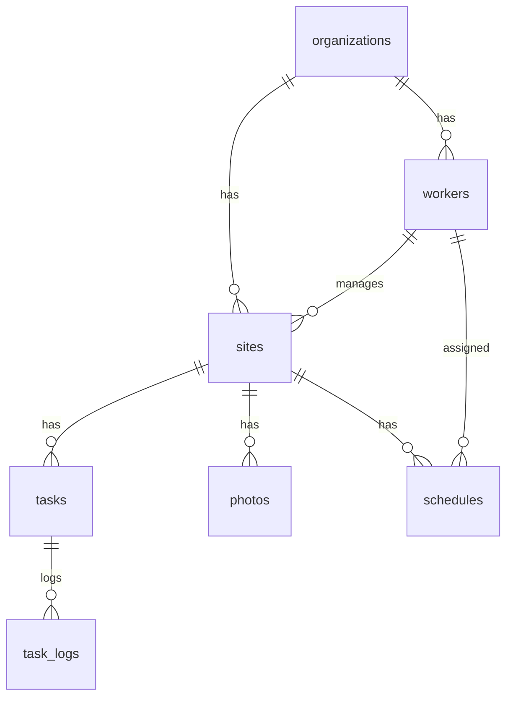

# Stark Works 仕様書

| 項目 | 内容 |
|------|------|
| プロジェクト名 | Stark Works |
| 版 | 1.0（MVP） |
| 最終更新 | 2026年6月 |
| ステータス | 実装済み（納品可能レベル） |

---

## 1. システム概要

### 1.1 目的

建設業・設備業・水道業向けの**現場進捗管理システム**。
現場の登録、作業の完了管理、進捗の可視化、写真の記録、スケジュール管理をスマートフォン中心に行う。

### 1.2 対象業種

- 水道工事会社
- 電気工事会社
- 空調設備会社
- 外構業者
- 塗装業者

### 1.3 対象ユーザー

| ユーザー | 想定 | 主な利用端末 |
|---------|------|-------------|
| 管理者（社長・事務） | 現場・作業員の登録、全体把握 | PC / タブレット |
| 作業員 | 現場での作業完了・写真撮影 | **スマートフォン（メイン）** |

### 1.4 設計方針

- **60代でも使える**シンプルなUIを最優先
- **スマホファースト**（現場利用を前提）
- ログイン不要のデモ運用（本番では認証追加可能）
- 日本語UIのみ

---

## 2. 技術スタック

| 区分 | 技術 |
|------|------|
| フロントエンド | Next.js 15（App Router）、TypeScript、TailwindCSS |
| UIコンポーネント | shadcn/ui（Radix UI ベース） |
| バックエンド | Supabase（PostgreSQL、Storage） |
| 認証 | Supabase Auth（現状未使用・将来拡張用） |
| デプロイ | Vercel |
| バリデーション | Zod |

---

## 3. 機能一覧

### 3.1 実装済み機能

| # | 機能 | 説明 | 状態 |
|---|------|------|------|
| 1 | ダッシュボード | 本日の現場数・作業中・完了・作業員数をカード表示 | ✅ |
| 2 | 現場管理 | 現場の登録・一覧・詳細・編集・削除 | ✅ |
| 3 | 作業チェックリスト | 現場ごとの作業登録・完了ボタン | ✅ |
| 4 | 進捗率管理 | (完了数÷全項目数)×100、プログレスバー表示 | ✅ |
| 5 | 作業員管理 | 作業員の登録・一覧・編集・削除（論理削除） | ✅ |
| 6 | 写真管理 | 着工前/作業中/完了後の写真撮影・アップロード | ✅ |
| 7 | スケジュール | 日/週/月表示、予定の登録・削除 | ✅ |
| 8 | スマホ対応 | 下部ナビ、FAB、safe-area、ホーム画面追加 | ✅ |

### 3.2 未実装（将来拡張）

| 機能 | 備考 |
|------|------|
| ログイン・権限管理 | DB設計済み、UIは削除済み |
| スケジュールのドラッグ＆ドロップ | 現状はフォーム登録のみ |
| プッシュ通知 | — |
| 帳票出力（PDF） | — |
| 複数テナント管理画面 | 現状は単一組織デモ |

---

## 4. 画面仕様

### 4.1 画面一覧

| 画面名 | URL | 説明 |
|--------|-----|------|
| トップ | `/` | ダッシュボードへリダイレクト |
| ホーム（ダッシュボード） | `/dashboard` | 統計カード・クイックアクション |
| 現場一覧 | `/sites` | 現場カード一覧、FABで新規登録 |
| 現場登録 | `/sites/new` | 現場情報入力フォーム |
| 現場詳細 | `/sites/[id]` | 進捗・作業・写真・現場情報 |
| 現場編集 | `/sites/[id]/edit` | 現場情報の更新・削除 |
| 作業員一覧 | `/workers` | 作業員カード一覧 |
| 作業員登録 | `/workers/new` | 作業員情報入力 |
| 作業員編集 | `/workers/[id]/edit` | 作業員情報の更新・削除 |
| スケジュール | `/schedule` | 日/週/月カレンダー、予定管理 |

### 4.2 ナビゲーション

**スマホ（メイン）**

- 画面上部: アプリ名ヘッダー
- 画面下部: 固定タブ（ホーム / 現場 / 予定 / 作業員）
- 右下: フローティング＋ボタン（現場・作業員一覧）

**PC**

- 左サイドバー: 全メニュー
- 下部タブ: 非表示

### 4.3 画面別詳細

#### ホーム（ダッシュボード）

**表示項目**

| カード | 算出方法 |
|--------|---------|
| 本日の現場 | 本日のスケジュールに登録された現場数（重複除く） |
| 作業中 | ステータスが `in_progress` の現場数 |
| 完了現場 | ステータスが `completed` の現場数 |
| 作業員数 | `is_active = true` の作業員数 |

**操作**

- 各カードタップ → 関連画面へ遷移
- クイックアクション（4つ）→ 現場・予定・作業員へ
- 「現場一覧を見る」ボタン

#### 現場一覧

**表示項目（カード1件あたり）**

- 現場名
- 顧客名
- 住所
- ステータスバッジ
- 進捗バー（％）
- 作業完了数 / 全作業数

**操作**

- カードタップ → 現場詳細
- ＋ボタン → 現場登録

#### 現場登録 / 編集

| 項目 | 必須 | 型 | 備考 |
|------|------|-----|------|
| 現場名 | ✅ | テキスト | |
| 顧客名 | — | テキスト | |
| 住所 | — | テキスト | |
| 電話番号 | — | tel | |
| 工事開始日 | — | 日付 | |
| 工事完了予定日 | — | 日付 | |
| 担当責任者 | — | 選択 | 作業員マスタから |
| ステータス | ✅ | 選択 | 下表参照 |

**ステータス**

| 値 | 表示 |
|----|------|
| `not_started` | 未着工 |
| `in_progress` | 作業中 |
| `on_hold` | 保留 |
| `completed` | 完了 |

#### 現場詳細

**セクション構成（上から順）**

1. **進捗** — プログレスバー、次の作業の案内
2. **作業チェックリスト** — 完了ボタン（全幅・特大）
3. **現場写真** — カテゴリ切替、カメラ撮影
4. **現場情報** — 電話発信・地図リンク

#### 作業チェックリスト

| 操作 | 説明 |
|------|------|
| 完了 | 作業を完了にし、完了日時を記録 |
| 追加 | 新しい作業項目を登録 |
| 削除 | 作業項目を削除 |

**保存内容（完了時）**

- `is_completed = true`
- `completed_at` = 完了日時

#### 写真管理

| カテゴリ | 値 | 表示名 |
|---------|-----|--------|
| 着工前 | `before` | 着工前 |
| 作業中 | `during` | 作業中 |
| 完了後 | `after` | 完了後 |

**操作**

- 「写真を撮る」→ スマホカメラ起動（`capture="environment"`）
- 削除ボタンで写真削除

**保存先**

- Supabase Storage バケット `site-photos`
- パス: `{organization_id}/{site_id}/{category}/{timestamp}.{ext}`

#### 作業員管理

| 項目 | 必須 | 型 |
|------|------|-----|
| 氏名 | ✅ | テキスト |
| 電話番号 | — | tel |
| メールアドレス | — | email |
| 役職 | — | テキスト |

**削除** — 論理削除（`is_active = false`）

#### スケジュール

| 項目 | 必須 | 型 |
|------|------|-----|
| 作業内容 | ✅ | テキスト |
| 現場 | ✅ | 選択 |
| 作業員 | ✅ | 選択 |
| 日付 | ✅ | 日付 |
| 開始時間 | ✅ | 時刻 |
| 終了時間 | ✅ | 時刻 |

**表示モード**

- **日** — 選択日の予定一覧
- **週** — 当週の予定一覧
- **月** — カレンダーグリッド（日付タップで日表示へ）

---

## 5. データベース設計

### 5.1 ER図



### 5.2 テーブル定義

#### organizations（組織）

| カラム | 型 | 説明 |
|--------|-----|------|
| id | UUID | PK |
| name | TEXT | 会社名 |
| created_at | TIMESTAMPTZ | 作成日時 |

#### workers（作業員）

| カラム | 型 | 説明 |
|--------|-----|------|
| id | UUID | PK |
| organization_id | UUID | FK |
| full_name | TEXT | 氏名 |
| phone | TEXT | 電話 |
| email | TEXT | メール |
| position | TEXT | 役職 |
| is_active | BOOLEAN | 有効フラグ |
| created_at / updated_at | TIMESTAMPTZ | |

#### sites（現場）

| カラム | 型 | 説明 |
|--------|-----|------|
| id | UUID | PK |
| organization_id | UUID | FK |
| name | TEXT | 現場名 |
| customer_name | TEXT | 顧客名 |
| address | TEXT | 住所 |
| phone | TEXT | 電話 |
| start_date | DATE | 開始日 |
| expected_end_date | DATE | 完了予定日 |
| manager_id | UUID | FK → workers |
| status | TEXT | ステータス |
| created_at / updated_at | TIMESTAMPTZ | |

#### tasks（作業）

| カラム | 型 | 説明 |
|--------|-----|------|
| id | UUID | PK |
| site_id | UUID | FK |
| organization_id | UUID | FK |
| title | TEXT | 作業名 |
| sort_order | INT | 表示順 |
| is_completed | BOOLEAN | 完了フラグ |
| completed_at | TIMESTAMPTZ | 完了日時 |
| completed_by | UUID | FK → workers |
| created_at | TIMESTAMPTZ | |

#### schedules（スケジュール）

| カラム | 型 | 説明 |
|--------|-----|------|
| id | UUID | PK |
| organization_id | UUID | FK |
| site_id | UUID | FK |
| worker_id | UUID | FK |
| title | TEXT | 作業内容 |
| start_time | TIMESTAMPTZ | 開始 |
| end_time | TIMESTAMPTZ | 終了 |

#### photos（写真）

| カラム | 型 | 説明 |
|--------|-----|------|
| id | UUID | PK |
| site_id | UUID | FK |
| organization_id | UUID | FK |
| storage_path | TEXT | Storageパス |
| category | TEXT | before/during/after |
| file_name | TEXT | 元ファイル名 |
| uploaded_by | UUID | 任意（デモではNULL） |
| created_at | TIMESTAMPTZ | |

#### site_progress（ビュー）

進捗率を自動計算するビュー。

```
progress_percent = ROUND((完了タスク数 / 全タスク数) × 100)
```

### 5.3 マイグレーション実行順

1. `001_initial_schema.sql` — テーブル・RLS・Storage
2. `002_demo_rls.sql` — ログインなし閲覧用ポリシー
3. `003_demo_storage.sql` — 写真アップロード用
4. `004_fix_photos.sql` — uploaded_by 任意化
5. `seed.sql`（任意）— デモデータ

---

## 6. API仕様（Server Actions）

### 6.1 現場（sites）

| Action | 入力 | 出力 |
|--------|------|------|
| `getSites()` | — | `SiteWithProgress[]` |
| `getSite(id)` | siteId | `Site \| null` |
| `createSite(formData)` | フォームデータ | 登録後 `/sites` へ遷移 |
| `updateSite(id, formData)` | フォームデータ | 更新後詳細へ遷移 |
| `deleteSite(id)` | siteId | 削除後一覧へ遷移 |

### 6.2 作業（tasks）

| Action | 入力 | 出力 |
|--------|------|------|
| `getTasks(siteId)` | siteId | `Task[]` |
| `createTask(siteId, title)` | 作業名 | `ActionResult<Task>` |
| `completeTask(taskId, siteId)` | — | 完了登録 |
| `deleteTask(taskId, siteId)` | — | 削除 |

### 6.3 作業員（workers）

| Action | 入力 | 出力 |
|--------|------|------|
| `getWorkers()` | — | `Worker[]` |
| `getWorker(id)` | workerId | `Worker \| null` |
| `createWorker(formData)` | フォームデータ | 登録後一覧へ |
| `updateWorker(id, formData)` | フォームデータ | 更新後一覧へ |
| `deleteWorker(id)` | workerId | 論理削除 |

### 6.4 写真（photos）

| Action | 入力 | 出力 |
|--------|------|------|
| `getPhotos(siteId)` | siteId | `Photo[]`（URL付き） |
| `uploadPhoto(siteId, formData)` | file, category | `ActionResult<Photo>` |
| `deletePhoto(photoId, siteId)` | — | 削除 |

### 6.5 スケジュール（schedules）

| Action | 入力 | 出力 |
|--------|------|------|
| `getSchedules(start, end)` | 期間 | `Schedule[]` |
| `createSchedule(formData)` | フォームデータ | `ActionResult<Schedule>` |
| `deleteSchedule(id)` | scheduleId | 削除 |

### 6.6 ダッシュボード

| Action | 入力 | 出力 |
|--------|------|------|
| `getDashboardStats()` | — | `{ todaySites, inProgressSites, completedSites, workerCount }` |

### 6.7 レスポンス形式

```typescript
type ActionResult<T> =
  | { success: true; data: T }
  | { success: false; error: string };
```

---

## 7. UI/UX仕様

### 7.1 ターゲット

**60代の現場作業員・社長**が迷わず使えること。

### 7.2 デザインルール

| 項目 | 仕様 |
|------|------|
| ベースフォント | 18px |
| 見出し | 24〜32px、太字 |
| ボタン高さ | 56〜64px |
| タップ領域 | 最小 48×48px |
| コントラスト | 高コントラスト（濃い文字・明確な枠線） |
| 言語 | 日本語のみ |
| 余白 | 十分な padding（16〜24px） |

### 7.3 スマホ専用機能

| 機能 | 説明 |
|------|------|
| 下部固定ナビ | 4タブ、現在地を青線で表示 |
| FAB（＋ボタン） | 現場・作業員の新規登録 |
| safe-area | iPhone ノッチ・ホームバー対応 |
| カメラ直接起動 | 写真撮影 |
| tel: リンク | ワンタップ電話 |
| Google Maps リンク | ワンタップ地図 |
| ホーム画面追加 | PWA manifest 対応 |
| タップフィードバック | 押下時に軽く縮小 |

### 7.4 案内表示

各主要画面に青い **HelpBanner** を表示し、操作手順を簡潔に案内。

---

## 8. セキュリティ

### 8.1 現状（デモ運用）

| 項目 | 状態 |
|------|------|
| ログイン | なし（誰でもアクセス可） |
| RLS | 有効（anon ロールに全操作許可のデモポリシー） |
| Storage | 公開バケット（デモ用） |

### 8.2 本番運用時の推奨

- Supabase Auth によるログイン復活
- admin / worker ロールによる権限分離（DB設計済み）
- RLS ポリシーを本番用に差し替え
- Storage を非公開 + 署名付きURL

---

## 9. 環境・デプロイ

### 9.1 環境変数

| 変数名 | 説明 | 例 |
|--------|------|-----|
| `NEXT_PUBLIC_SUPABASE_URL` | Supabase Project URL | `https://xxx.supabase.co` |
| `NEXT_PUBLIC_SUPABASE_ANON_KEY` | 公開キー | `sb_publishable_...` |
| `NEXT_PUBLIC_APP_URL` | アプリURL | `http://localhost:3000` |

### 9.2 ローカル開発

```bash
npm install
npm run dev
```

### 9.3 本番デプロイ（Vercel）

1. GitHub にリポジトリをプッシュ
2. Vercel でインポート
3. 環境変数を設定
4. Deploy

### 9.4 コスト（無料枠）

| サービス | 無料枠 |
|---------|--------|
| Vercel | 個人利用無料 |
| Supabase | 500MB DB、1GB Storage 無料 |

---

## 10. フォルダ構成

```
stark-works/
├── app/                    # 画面（App Router）
│   ├── (dashboard)/        # メイン画面群
│   ├── layout.tsx
│   └── globals.css
├── components/
│   ├── ui/                 # 基本UI
│   ├── layout/             # ヘッダー・ナビ
│   ├── dashboard/          # ダッシュボード
│   ├── sites/              # 現場関連
│   ├── workers/            # 作業員関連
│   ├── schedule/           # スケジュール
│   └── shared/             # 共通部品
├── lib/
│   ├── actions/            # Server Actions
│   ├── supabase/           # Supabase クライアント
│   ├── types/              # 型定義
│   ├── validations/        # Zod スキーマ
│   └── utils/              # ユーティリティ
├── supabase/
│   ├── migrations/         # SQL マイグレーション
│   └── seed.sql            # デモデータ
├── public/
│   ├── manifest.json       # PWA
│   └── icon.svg
└── docs/
    ├── DESIGN.md           # 設計書（詳細）
    └── SPECIFICATION.md    # 本仕様書
```

---

## 11. 改訂履歴

| 版 | 日付 | 内容 |
|----|------|------|
| 1.0 | 2026-06 | MVP 初版。全機能実装・スマホ対応完了 |

---

## 12. 関連ドキュメント

- [DESIGN.md](./DESIGN.md) — 詳細設計・アーキテクチャ・ER図
- [README.md](../README.md) — セットアップ手順
